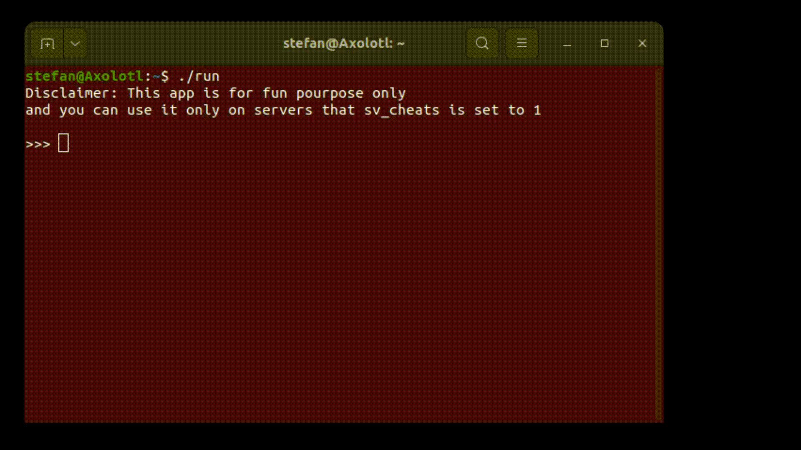

# CS-GO_Cheats

A database of all possible commands you could use on a CS:GO server in order to get some advantage in game.

## Demo




## Run Locally

Clone the project

```bash

  git clone https://github.com/Ctrl-AltElite/CS-GO_Cheats.git

```

Go to the project directory

```bash

  cd CS-GO_Cheats

```

Install dependencies (only instructions for linux)

```bash

  sudo-apt install gcc make

```


Compile

```bash

  make

```


Run

```bash

  ./CS-GO_Cheats

```
